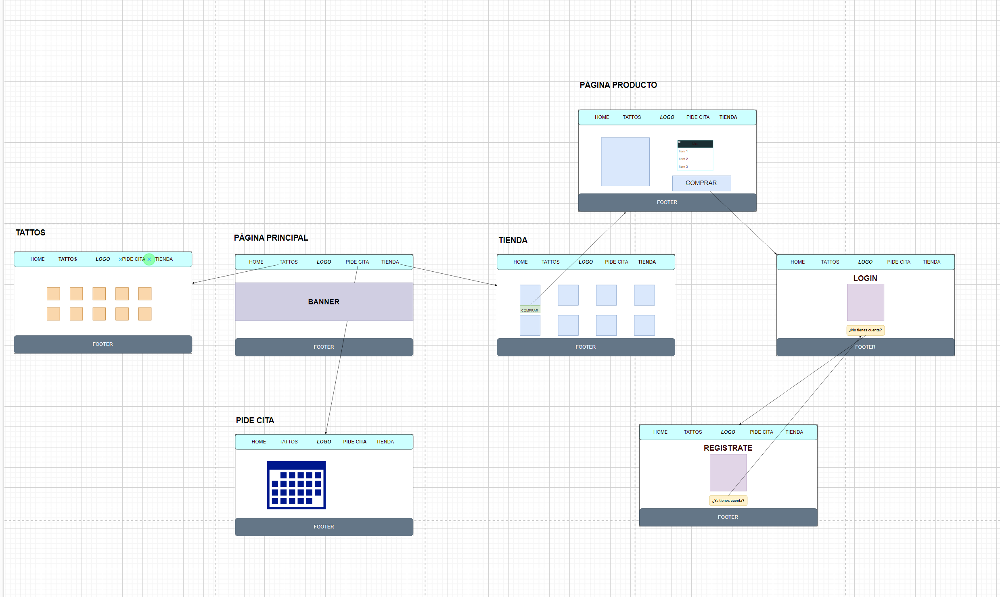
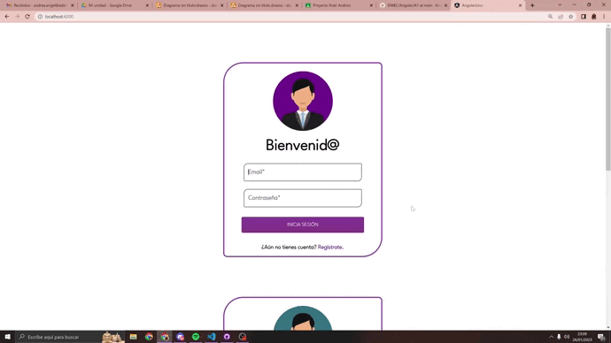
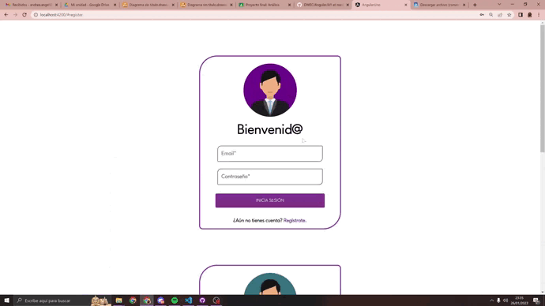
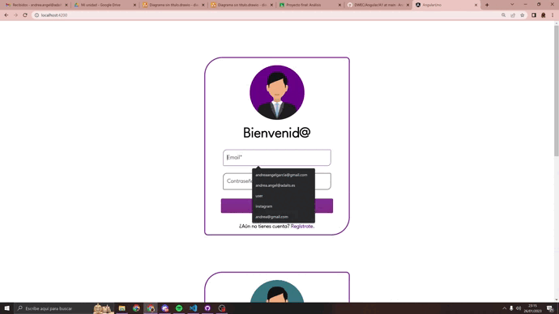

# ANGULAR

> *BOLETÍN A1 AVANZADO* ☝️

---

## 🔎 Análisis del problema.

     -> Se requiere realizar los siguientes ejercicios:
          1. Seguir los pasos de instalación del vídeo suministrado “Instalación Angular.mp4”.
          2. Crear los componentes que se indican en la siguiente imagen con la ayuda del vídeo “Componentes Angular.mp4”.
          3. Añadir las verificaciones de cada input-botón mostrando un error en caso de que no se cumplan:
              - Email: Debe ser un email con su @ y otras validaciones. Buscar en internet. No debe estar vacío.
              - Password: No deben mostrarse los caracteres, sólo los puntos. No debe estar vacío.
              - Last Name: Puede estar vacío. Es un input normal.
              - First Name: No puede estar vacío. Es un input normal.
              - Botón con texto: Puede estar habilitado o deshabilitado.
              - Hiperenlace: Mostrará diferentes textos.
          4. Añadir un componente que se pueda utilizar para el proyecto individual.
          5. Realizar un boceto de cada una de las pantallas que se vayan a utilizar en el proyecto individual con la finalidad 
             de reutilizar este trabajo y así reducir el esfuerzo total.

Primero instalaremos Angular con las indicaciones del profesor y con ayuda del vídeo.
Luego creamos los componentes (Login, registro y footer).
    
  ## -> inner.HTML
  La propiedad Element.innerHTML devuelve o establece la sintaxis HTML describiendo los descendientes del elemento.
  
 

---

## ✏️ Diseño de la solución.

Para realizar este apartado de Tarea AVANZADA, lo primero que he hecho es buscar información sobre los scripts y sobre lo que me pedía el ejercicio. A continuación, he buscado ejemplos e información en internet y he encontrado unos métodos para insertar filas y columnas desde js ( .insertRow() e .insertCell() ). Después de encontrar esta información toca implementarla en la siguiente fase.

---

## 📝 Implementación de la solución.

En este apartado vamos a ponernos a implementar todos los apartados anteriores, vamos a hacer el ejemplo y los gifs de cada prueba.

---

## 💡 Pruebas.

                                                                          Criterio 1:
                                                            Dado que tengo un método generaDatos(5, 4)
                                                            Cuando pongo los valores fila 5 y columna 4
                                       Entonces me aparece en el html una tabla con 5 filas y 4 columnas con datos randoms.

---

                                                                  Criterio 2:
                                                    Dado que tengo un método generaDatos(4, 5)
                                                    Cuando pongo los valores fila 4 y columna 5
                                      Entonces me aparece en el html una tabla con 4 filas y 5 columnas con datos randoms.

---

                                                                  Criterio 3:
                                                    Dado que tengo un método generaDatos(12, 8)
                                                    Cuando pongo los valores fila 12 y columna 8
                                 Entonces me aparece en el html una tabla con 12 filas y 8 columnas con datos randoms.

---

