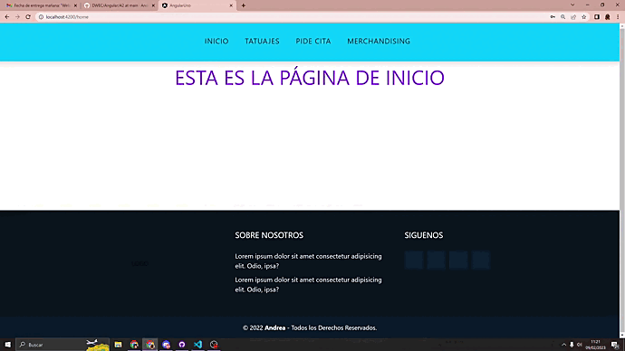

# ANGULAR

> *BOLETÍN A2 AVANZADO* ☝️

---

## 🔎 Análisis del problema.

     -> Se requiere realizar el siguiente ejercicio:
         Siguiendo el boceto del anterior boletín avanzado o suministrando uno más actualizado para el proyecto individual. Establecer toda la navegación entre componentes o páginas del proyecto individual, aplicando las validaciones que se vean oportunas en el caso que toque.

Primero instalaremos Angular con las indicaciones del profesor y con ayuda del vídeo.
Luego creamos los componentes (Login, registro y footer).
    

 

---

## ✏️ Diseño de la solución.

Para realizar este apartado de Tarea AVANZADA, lo primero que he hecho es buscar información sobre los scripts y sobre lo que me pedía el ejercicio. A continuación, he buscado ejemplos e información en internet y he encontrado unos métodos para insertar filas y columnas desde js ( .insertRow() e .insertCell() ). Después de encontrar esta información toca implementarla en la siguiente fase.

---

## 📝 Implementación de la solución.

En este apartado vamos a ponernos a implementar todos los apartados anteriores, vamos a hacer el ejemplo y los gifs de cada prueba.

---

## 💡 Pruebas.

                                                                          Criterio 1:
                                                            Dado que tengo un método generaDatos(5, 4)
                                                            Cuando pongo los valores fila 5 y columna 4
                                       Entonces me aparece en el html una tabla con 5 filas y 4 columnas con datos randoms.

---

                                                                  Criterio 2:
                                                    Dado que tengo un método generaDatos(4, 5)
                                                    Cuando pongo los valores fila 4 y columna 5
                                      Entonces me aparece en el html una tabla con 4 filas y 5 columnas con datos randoms.

---

                                                                  Criterio 3:
                                                    Dado que tengo un método generaDatos(12, 8)
                                                    Cuando pongo los valores fila 12 y columna 8
                                 Entonces me aparece en el html una tabla con 12 filas y 8 columnas con datos randoms.

---

