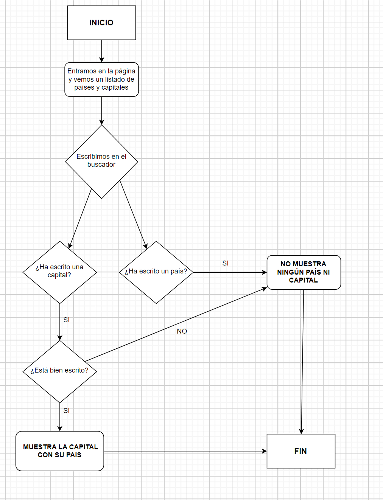
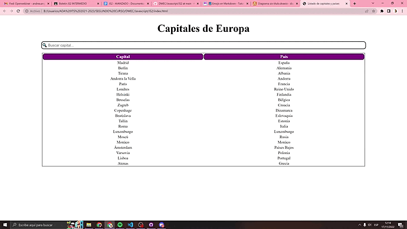
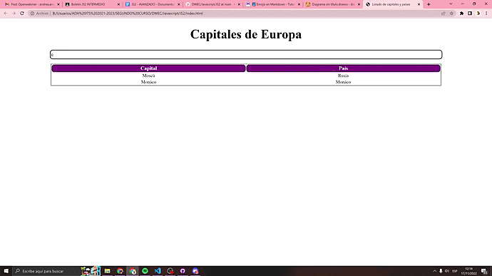
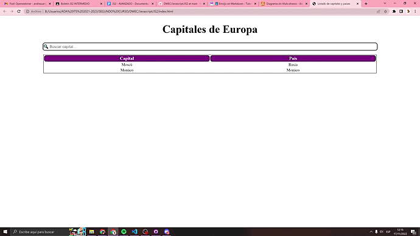
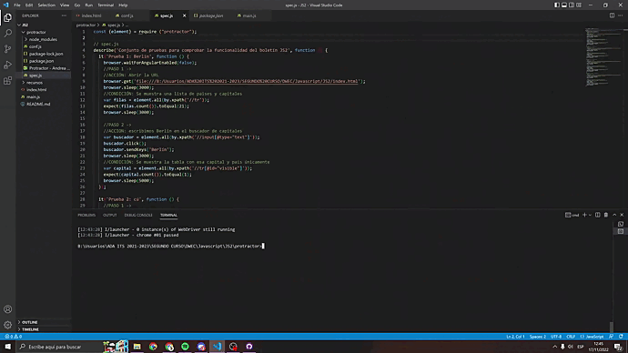

# JAVASCRIPT

> *BOLETÍN JS2 AVANZADO* ☝️

---

## 🔎 Análisis del problema.
Estos son los pasos y apartados que debemos seguir en este boletín:

        Los ejercicios de este boletín van enfocados en el uso de los conceptos de JSON y el uso del DOM con Protractor 
        para automatizar pruebas.
        
         1. Generación de json de capitales y países.

         2. Modificación y visualización de los cambios en la web.

         3. Filtrado de datos.
         
         4. Automatización de las pruebas arriba mencionadas con protractor siguiendo las pautas del vídeo 
         aportado en el taller de protractor.

Primero vamos a analizar cada uno de los términos por pasos y saber su definición:

### JSON 📜
`JavaScript Object Notation` (JSON) es un formato basado en texto estándar para representar datos estructurados en la sintaxis de objetos de JavaScript. Es comúnmente utilizado para transmitir datos en aplicaciones web.

**Ejemplo:**

      [
      {
        "name": "Molecule Man",
        "age": 29,
        "secretIdentity": "Dan Jukes",
        "powers": [
          "Radiation resistance",
          "Turning tiny",
          "Radiation blast"
        ]
      },
      {
        "name": "Madame Uppercut",
        "age": 39,
        "secretIdentity": "Jane Wilson",
        "powers": [
          "Million tonne punch",
          "Damage resistance",
          "Superhuman reflexes"
        ]
      }
    ]

### DOM 📰
Las siglas DOM significan `Document Object Model`, o lo que es lo mismo, la estructura del documento HTML. Una página HTML está formada por múltiples etiquetas HTML, anidadas una dentro de otra.

En Javascript, cuando nos referimos al DOM nos referimos a esta estructura, que podemos modificar de forma dinámica desde Javascript.

--- 

Para realizar el ejercicio debo buscar los siguientes términos para poder realizarlo al completo:

## -> <script>

El elemento HTML Script `(<script>)` se utiliza para insertar o hacer referencia a un script ejecutable dentro de un documento HTML o XHTML.

Los `scripts` sin atributo `async` o `defer`, así como las secuencias de comandos en línea, son interpretados y ejecutados inmediatamente, antes de que el navegador continúe procesando la página.

## -> .getElementById
El método `getElementById` permite seleccionar un elemento del documento por medio del valor del atributo id que se le haya asignado. Su sintaxis es la siguiente:
  
    document.getElementById('id_del_elemento');

## -> onKeyUp

Ejecuta un JavaScript cuando un usuario suelta una clave:

    <input type="text" onkeyup="myFunction()">

## -> .innerHTML

La propiedad `Element.innerHTML` devuelve o establece la sintaxis HTML describiendo los descendientes del elemento. Nos permite leer un dato o asignarlo al contenido de un div o bien, del mismo control. Nos facilita la asignación de valores a controles. 

## -> forEach()

El método `forEach()` ejecuta la función indicada una vez por cada elemento del array.

     arr.forEach(function callback(currentValue, index, array) {
         // tu iterador
     }[, thisArg]);
      
## -> .value
Devuelve la propiedad de valor. 
- Valor de retorno:	Una cadena, que representa el valor del campo de texto.

## -> .getElementsByTagName
El método 'getElementsByTagName' selecciona una lista de nodos cuyo elemento es el especificado como parámetro; a cada uno de los nodos se le asigna un índice, de acuerdo al orden en el que aparecen en el marcado del documento. Su sintaxis:

    document.getElementsByTagName('elemento');
    document.getElementsByTagName('elemento')[índice_del_elemento];
    
    
- document.getElementsByTagName('p');  --> nos devuelve una lista con todos los párrafos del documento.

## -> style.display
La propiedad de visualización establece o devuelve el tipo de visualización del elemento.

Los elementos en HTML son en su mayoría elementos "en línea" o "bloque": un elemento en línea tiene contenido flotante en su lado izquierdo y derecho. Un elemento de bloque llena toda la línea y no se puede mostrar nada en su lado izquierdo o derecho.

    display="none";
    
## -> .indexOf()
El método `indexOf()` devuelve el índice, dentro del objeto String que realiza la llamada, de la primera ocurrencia del valor especificado, comenzando la búsqueda desde indice; o -1 si no se encuentra dicho valor.

    cadena.indexOf(valorBusqueda[, indice]);
    
 ## -> .toUpperCase(), .toLowerCase()
 El método `.toUpperCase()` convierte una cadena en letras mayúsculas.
 
 El método `.toLowerCase()` convierte una cadena en letras minúsculas.
            
---

## ✏️ Diseño de la solución.

Para realizar este apartado de Tarea AVANZADA, lo primero que he hecho es poner en práctica todo lo buscado en `Análisis del problema`. A continuación, he buscado ejemplos de como mostrar un JSON en una tabla y después de como filtrar esa tabla. 

### DIAGRAMA DE FLUJO 📈

---

## 📝 Implementación de la solución.

En este apartado vamos a ponernos a implementar todos los apartados anteriores, vamos a hacer el ejercicio completo, la parte de automatización y los gifs de cada prueba.

---

## 💡 Pruebas.

                                                                         Criterio 1:
                                                   Dado que tenemos una tabla con las capitales y países,
                                                         Cuando introducimos en el buscador “Berlín”,
                                               Entonces aparecerá la tabla con esa capital y país únicamente.

---

                                                                        Criterio 2:
                                                Dado que tenemos una tabla con las capitales y países,
                                                         Cuando introducimos en el buscador “cú”,
                                       Entonces aparecerá la tabla con la capital “Moscú” y su país únicamente.
                                          
                                          
                                          
                                          
---

                                                                      Criterio 3:
                                                  Dado que tenemos una tabla con las capitales y países,
                                                         Cuando introducimos en el buscador “cu”,
                                                         Entonces aparecerá la tabla sin valores.

---

                                                                       Criterio 4:
                                               Dado que tenemos una tabla con las capitales y países,
                                                   Cuando introducimos en el buscador “Alemania”,
                                                     Entonces aparecerá la tabla sin valores.

---

                                          
                                          
### 📲 AUTOMATIZACIÓN:                                       

                                                 Prueba de la automatización de las pruebas arriba mencionadas.

