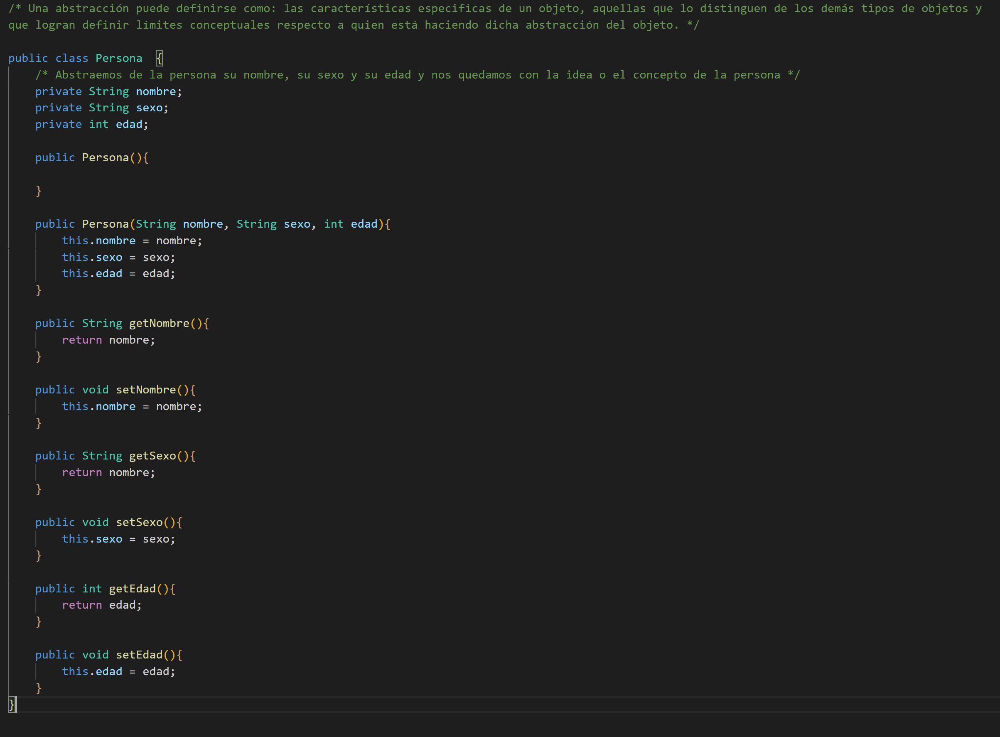
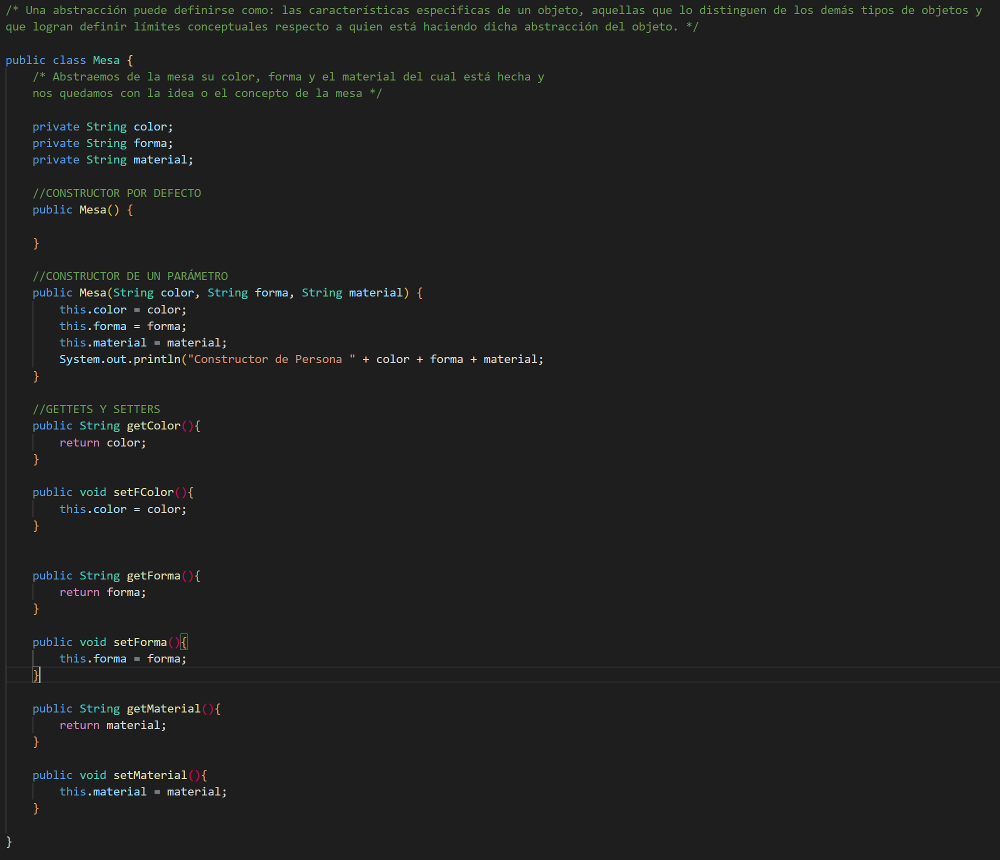
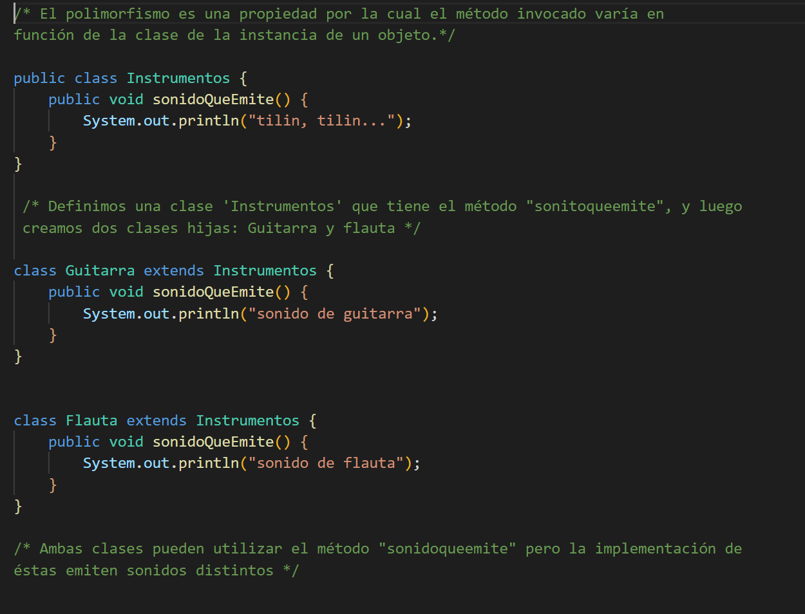

# PROGRAMACIÓN ORIENTADA A OBJETOS

> *BOLETÍN POO AVANZADO* ☝️

---

## 🔎 Análisis del problema.

Se requieren ejemplos de encapsulación, abstracción, herencia y polimorfismo en Java 1.8.

Primero vamos a analizar cada uno de los términos y saber su definición:
## -> Encapsulación
  Contiene toda la información de un objeto y oculta los datos de tal forma que sólo sean accesibles mediante operaciones definidas por el propio      objeto.
  El término encapsulamiento en Java, consiste en ocultar atributos de un objeto de manera que solo se pueda cambiar mediante operaciones definidas en ese objeto. Está   estrechamente relacionado con la visibilidad. 
  Para definir la visibilidad en Java, se dispone de palabras reservadas:
  
  
        - public: nos indica que es accesible desde cualquier clase [interface].
        - private: solo es accesible desde a clase actual.
        - protected: accesible desde la clase actual, sus descendientes o el paquete del que forma parte.
        - sin ninguna palabra: accesible desde cualquier clase del paquete.
  
## -> Abstracción
La abstracción consiste en captar las características y funcionalidades que un objeto desempeña y estos son representados en clases por medio de atributos y métodos de dicha clase.

La abstracción también puede difinirse como las características especificas de un objeto, aquellas que lo distinguen de los demás tipos de objetos y que logran definir límites conceptuales respecto a quien está haciendo dicha abstracción del objeto.

Una abstracción se enfoca en la visión externa de un objeto,  separa el comportamiento  específico de un objeto, a esta división que realiza se le conoce como la barrera de abstracción, la cuál se consigue aplicando el principio de mínimo compromiso.

## -> Herencia
Propiedad a través de la cual los objetos heredan comportamiento dentro de una jerarquía de clases.
Las clases o tipos heredan de sus ancestros.

 - **Ventajas**:
 
      - Mejora el diseño.
      
      - Permite modelar relaciones de tipo “es un” que se dan en los
      problemas que se pretenden resolver.
      
      - Permite la reutilización del código.
      
      - Los métodos de la clase padre se reutilizan en las clases hijas.
      
      - Facilita la extensión de las aplicaciones.
      
      - Añadir una nueva subclase no requiere modificar ninguna otra clase
      de nuestro diseño.
      
      
 - **Desventajas**:
 
      - Aumenta el acoplamiento. Las subclases están íntimamente acopladas con la superclase.

## -> Polimorfismo
Es una propiedad por la cual el método invocado varía en función de la clase de la instancia de un objeto.
- Es la habilidad que poseen los objetos para reaccionar de modo diferente ante los mismos mensajes.
- El polimorfismo se refiere a la posibilidad de definir múltiples clases con funcionalidad diferente, pero con métodos o propiedades denominados de forma
idéntica, que pueden utilizarse de manera intercambiable mediante código cliente en tiempo de ejecución.

---

## ✏️ Diseño de la solución.

Para realizar este apartado de Tarea AVANZADA, lo primero que he hecho es buscar ejemplos de los diferentes ejercicios y realizar los UML.

**Estos son los UML necesarios para la solución:**

                                                          UML Ejemplo Polimorfismo
                                                

                                                           UML Ejemplo Herencia

---

## 📝 Implementación de la solución.

En este apartado vamos a ponernos a implementar todo el diseño del apartado anterior y hacer los ejemplos de cada uno.

---

## 💡 Pruebas.

                                                                   Prueba Encapsulación en Java

---

                                                                   Prueba 1 Abstracción en Java

---

                                                                   Prueba 2 Abstracción en Java

---

                                                                   Prueba Herencia en Java
                                                                   
                                                                   
                                                                   
                                                                   
 ---

                                                                   Prueba Polimorfismo en Java

